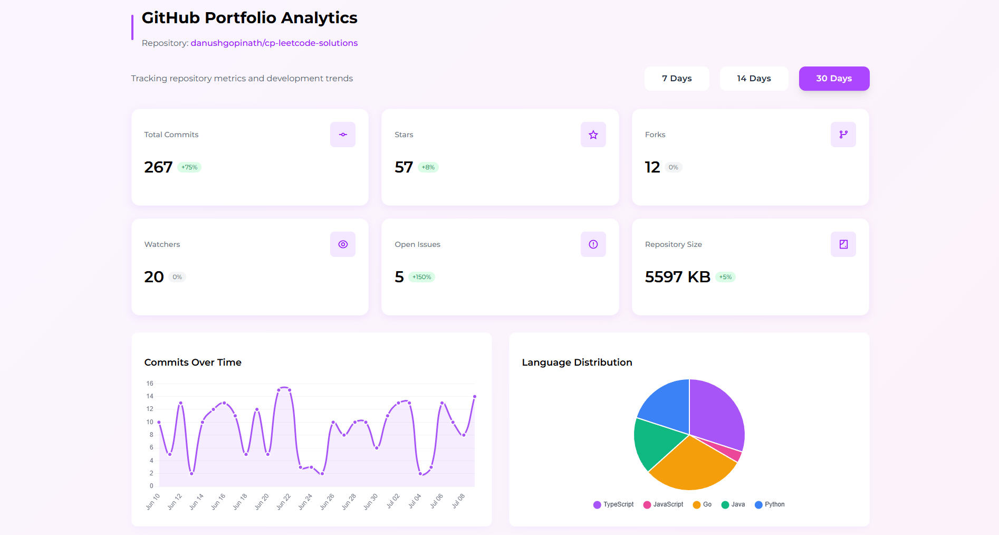
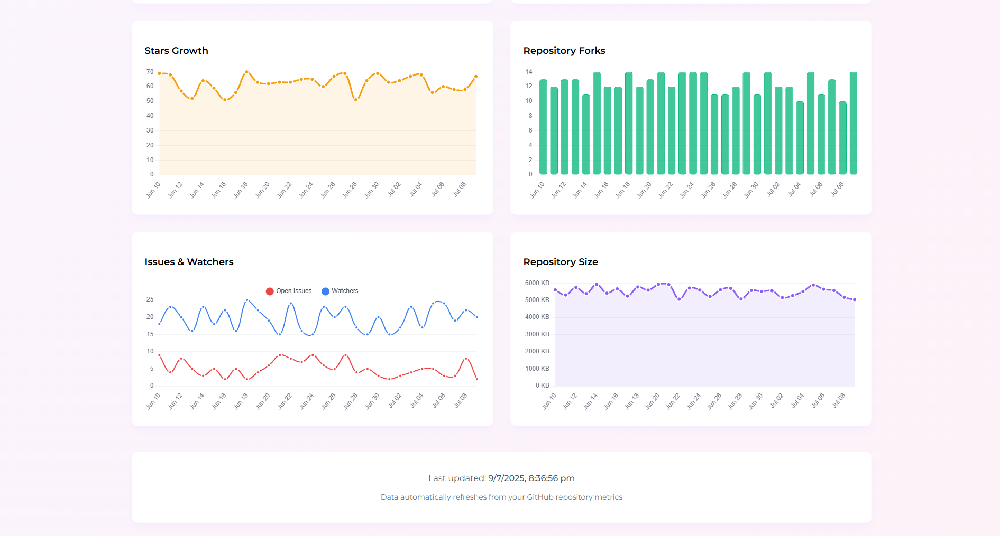

# GitHub Portfolio Analytics Dashboard

An interactive, responsive dashboard that visualises GitHub‑repository activity—commits, stars, forks, issues, language share, repository size and more—built with **Next .js 15 (App Router)**, **TypeScript**, **Tailwind CSS v4**, and **react‑chartjs‑2 / Chart.js v4**.

<p align="center">
  
  
</p>

---

## ✨ Features

| Area                | Highlights                                                                                                       |
|---------------------|-------------------------------------------------------------------------------------------------------------------|
| **Front‑end**       | Next .js (App Router), React 18, TypeScript, Tailwind v4 (no config file), Montserrat font, fully responsive      |
| **Charts**          | react-chartjs-2 v5 + Chart.js v4 (line, bar, area, pie) with tooltips, hover states, accessible `role="img"`      |
| **Data source**     | AWS Lambda Function URL that returns one row per day; fallback random mock data generator for offline dev         |
| **KPI cards**       | Commit, Stars, Forks, Watchers, Issues, Repo Size – live totals + % trend                                         |
| **Date filter**     | 7 / 14 / 30‑day segmented control                                           |
| **Skeleton loaders**| Smooth loading placeholders while fetching                                                                        |
| **Strict linting**  | ESLint + `@typescript-eslint`, Prettier                                                                           |


---

## 🗂 Project structure

```
github-dashboard/
├─ app/                     # Next App Router pages/layout
│  ├─ globals.css           # Tailwind directives + custom styles
│  ├─ layout.tsx            # Root layout (Google fonts, Remix-Icon)
│  └─ page.tsx              # Dashboard page
├─ components/
│  ├─ charts/               # 6 reusable chart components
│  └─ ui/                   # StatCard + DateRangeSelector
├─ lib/
│  ├─ api.ts                # Data‑fetching + mock-data generator
│  └─ types.ts              # Shared TypeScript types
├─ public/                  # Static assets (screenshots, favicon…)
├─ .env.local               # Environment variables (see below)
└─ …
```

---

## ⚙️ Getting Started

### 1  Clone & install

```bash
git clone https://github.com/danushgopinath/github-dashboard.git
cd github-dashboard
npm install
```

### 2  Environment variables

Create **`.env.local`** in the project root:

```env
# AWS Lambda Function URL (leave blank to force mock data)
NEXT_PUBLIC_METRICS_URL=https://abcd123.lambda-url.us-east-1.on.aws

# Optional – always return mock data even if URL is set
# NEXT_PUBLIC_FORCE_MOCK=true
```

### 3  Run in dev mode

```bash
npm run dev
# http://localhost:3000
```

### 4  Production build

```bash
npm run build   # production bundle
npm start       # start prod server
```

---

## 🧩 NPM scripts

| Command          | Description                                      |
|------------------|--------------------------------------------------|
| `npm run dev`    | Dev server with hot reload (Turbopack)           |
| `npm run build`  | Production build                                 |
| `npm start`      | Start production server                          |
| `npm run lint`   | ESLint + TypeScript checks                       |

---

## 🔄 Mock‑data mode

`generateMockData(days)` fabricates realistic history. Trigger by:

* leaving `NEXT_PUBLIC_METRICS_URL` empty, or
* setting `NEXT_PUBLIC_FORCE_MOCK=true`, or
* passing `mock=true` to `fetchMetrics`.

---

## ☁️ Deploy

### Vercel

```bash
npx vercel
```

### Static GitHub Pages

```js
// next.config.mjs
export default { output: 'export', distDir: 'dist' };
```

```bash
npm run build
git subtree push --prefix dist origin gh-pages
```

---

## 🛠 Extending

* **Add charts** – create a file in `components/charts`, register Chart.js elements, include in `page.tsx`.
* **Extra metrics** – extend `MetricRow` in `lib/types.ts`, update mock & Lambda payload, surface in UI.
* **Dark mode** – Tailwind `dark:` utilities + theme‑toggle.

---

## © License

MIT © Danush Gopinath
